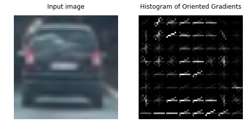
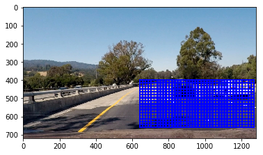
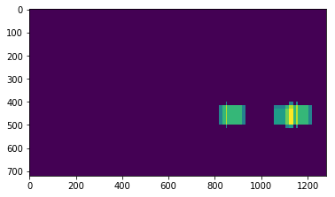
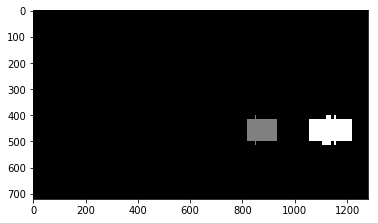
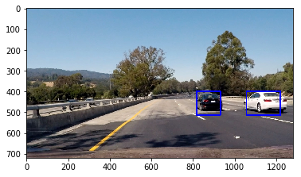

# Vehicle Detection Project

## Objective
The goal of this project is to annotate cars in a video stream by drawing rectangles around them.

## Approach
The detection pipeline can be roughly divided in three components:
- a classifier that takes a `64x64`
image (or a pre-processed version thereof) and says whether there is a car in that sub-image;
- a sliding-window method that selects which areas within the image will be fed to the classifier;
- a method for eliminating false positives and merging duplicates among the windows that were marked
  as positive.

## Feature selection
We used only HOG features, since it was fairly easy to achieve over `96%` accuracy in the validation
set. We tried a couple of SVM classifiers (`SVC` and `LinearSVC`), as well as an entropy-based
`RandomForestClassifier` and a `GradientBoostingClassifier`. Whilst they all performed reasonably
well, we settled for the `GradientBoostingClassifier` since it had the highest validation-set
accuracy (no parameter tuning was necessary).
The `hog` method was called with the following parameters:
```
orientations=6,
pixels_per_cell=(8, 8),
cells_per_block=(2, 2),
block_norm='L2-Hys',
```
The intuition behind these values is that we wanted to keep the feature vector small and start with
something that was close to the parameters suggested in class. Since we got good results with these,
no further tuning of these parameters was necessary.

Here is an example of how the HOG annotations look like.


All features were scaled using `StandardScaler` to have mean `0` and variance `1`.

## Sliding windows
We implemented two separate sliding window methods. First, we tried a multiscale sliding window,
as suggested in class, where different window sizes are used to account for cars that may be at
different relative distances from us. We also wrote a simpler sliding window method where all
windows were of the same size (`100x100`). The reason for this is that, since the windows will be
post-processed, it's fine to stick to smaller windows and have more of them, since we will have to
handle duplicate classifications anyway.
Since we are driving in the left lane throughout the entire video, we restrict our search to the
bottom-right quarter of the image.

Here is the uniscale grid of windows.


## Filtering
We used a single-frame heatmap (each box marked as a vehicle gets a vote) with a threshold of `>=3`
to filter out false positives and we made use of `scipy.ndimage.measurements` to merge boxes
corresponding to the same vehicle.

Here is what the heatmap looks like.


Here is how the `labels` method combines these.


Here is how a classified frame looks like.


## Directions for improvement
Although it would likely be easy to get an even-better classifier for this problem, I would first
devote time to improving the filtering methods, and perhaps include some across-time filtering as
the easiest (and likely most effective) way of improving the current pipeline.
